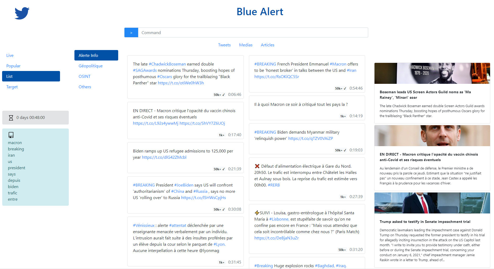

# Blue Alert

## Futures améliorations

- [ ] Intégrer à l'onglet tweet le status des tweets (provenant d'un compte vérifié, provenant d'un compte avec 1k+, 5k+, 10k+ de followers, tweet récent, tweet animé (prévoir une fonction f(likes, retweets) = score).
- [ ] Proposer un système de base de données permettant de configurer ses listes graphiquements ainsi que ses targets
- [ ] Intégrer un onglet plus convivial de tweets avec les images, les vidéos, voir les articles.
- [ ] Coder en backend une fonction pour retrouver le / les comptes à l'origine d'une tendance.
- [ ] Coder une fonction de reconnaissance de tendance (score [crisis, high, medium, low]) en fonction de la période de publication du premier au dernier tweet.

## Prérequis

```
pip install -r requirements.txt
```

Le backend tourne sous flask. Quelques bibliothèques pythons supplémentaires sont aussi nécessaires.

Enfin, il faut installer deux add-ons de nltk :

```
python3.x setup.py
```

## Installation.


Vous pouvez extraire le .zip dans un dossier (ex :`BlueAlert`)

Puis mettre ses 4 clefs twitter (une par ligne) dans un fichier  nommé `keys.txt` dans le dossier `twitter_app`.

Sous linux, pour lancer le serveur flask, executer :
```
export FLASK_APP=BlueAlert
flask run
```
> remplacer BlueAlert par le nom de votre dossier si celui-ci diffère. Les commande sont à executer dans l'espace de ce dossier.


## Utilisation

Le menu principal à gauche (Live, Popular...) détermine le type de recherche que vous voulez mener.

- Live : recherche des tweets les plus récents via la barre de recherche.
- Popular : recherche des tweets les plus populaires via la barre de recherche
- Liste : permet de sélectionner les listes don,t on veut obtenir les tweets
- Target : recherche spécifique sur les termes donnés dans le fichier `twitter_app/keywords.txt`

Le menu horizontal permet de naviguer entre les différents types de contenus.

A gauche on peut voir deux encarts : le sablier représente la durée écoulée entre le premier et le dernier tweet affichés et le livre représente la liste des mots clefs utilisés (bag of words).




