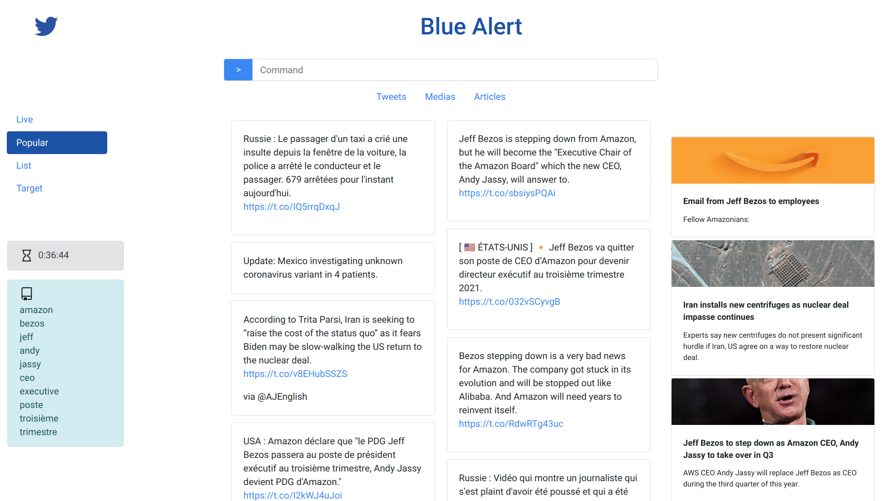

# Blue Alert

## Prérequis

```pip install -r requirements.txt```

Le backend tourne sous flask. Quelques bibliothèques pythons supplémentaires sont aussi nécessaires.

## Installation.

Vous pouvez extraire le .zip dans un dossier (ex :`BlueAlert`)

Sous linux, pour lancer le serveur flask, executer :
```
export FLASK_APP=BlueAlert
flask run
```
> remplacer BlueAlert par le nom de votre dossier si celui-ci diffère. Les commande sont à executer dans l'espace contenant ce dossier.

Enfin mettre ses 4 clefs twitter (une par ligne) dans un fichier  nommé `keys.txt` dans `twitter_app`.


## Utilisation

Le menu principal à gauche (Live, Popular...) détermine le type de recherche que vous voulez mener.

- Live : recherche des tweets les plus récents via la barre de recherche.
- Popular : recherche des tweets les plus populaires via la barre de recherche
- Liste : permet de sélectionner les listes don,t on veut obtenir les tweets
- Target : recherche spécifique sur les termes donnés dans le fichier `twitter_app/keywords.txt`

Le menu horizontal permet de naviguer entre les différents types de contenus.




